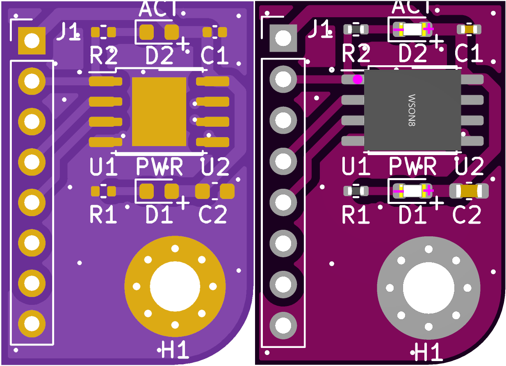

# W25Q-BRD project

W25Q-BRD project is meant to provide people with cheap SPI flash breakout board.

## W25Q-BRD

**W25Q-BRD** is a breakout board for DIY use.
This board features 128Mbit (16MB) serial flash chip W25Q128JVSIQ and M3 mounting hole.
The flash board runs on 3.3V and supports SPI and QSPI transfer modes.

Preview:

[Schematics in PDF format](doc/W25Q-BRD.pdf)

Features:

- Uses 3.3V voltage
- Runs in SPI and QSPI modes
- Simple 2 layer board design
- Common for DIY 2.54mm pitch connector
- Features SIOC-8 and WSON-8(6x5) footprints

CAM files are available.
JLCPCB BOM and CPL files are available.

### W25Q-BRD v1.0

Preview:

Initial version of the board.

### W25Q-BRD v1.1

Preview:

Added capacitors for better voltage stability.

### W25Q-BRD v1.2

Preview:

Added alternative WSON footprint to add more fabrication options.

## Board pinout

<table>
    <thead>
        <tr>
            <th>Pin</th><th>SPI mode</th><th>QSPI mode</th>
        </tr>
    </thead>
    <tbody>
        <tr>
            <td>3V3</td><td colspan=2>VCC of the chip, 3.3V</td>
        </tr>
        <tr>
            <td>NCS</td><td colspan=2>Chip select signal</td>
        </tr>
        <tr>
            <td>IO0</td><td>Data input</td><td>Data IO 0</td>
        </tr>
        <tr>
            <td>IO1</td><td>Data output</td><td>Data IO 1</td>
        </tr>
        <tr>
            <td>IO2</td><td>-</td><td>Data IO 2</td>
        </tr>
        <tr>
            <td>IO3</td><td>-</td><td>Data IO 3</td>
        </tr>
        <tr>
            <td>CLK</td><td colspan=2>(Q)SPI clock signal</td>
        </tr>
        <tr>
            <td>GND</td><td colspan=2>Ground</td>
        </tr>
    </tbody>
</table>

## Links

- Flash chip [W25Q128JVSIQ datasheet](doc/1811142111_Winbond-Elec-W25Q128JVSIQ_C97521.pdf)

## How to help

Your contributions as code, resources, or finances are welcome! Please contact me directly via email at andriy.golovnya@gmail.com or through my [GitHub profile](https://github.com/red-scorp).

If you'd like to make a financial contribution, you can donate via [PayPal](http://paypal.me/redscorp) or [Ko-Fi](http://ko-fi.com/redscorp). Your support is greatly appreciated.

Thanks in advance!
